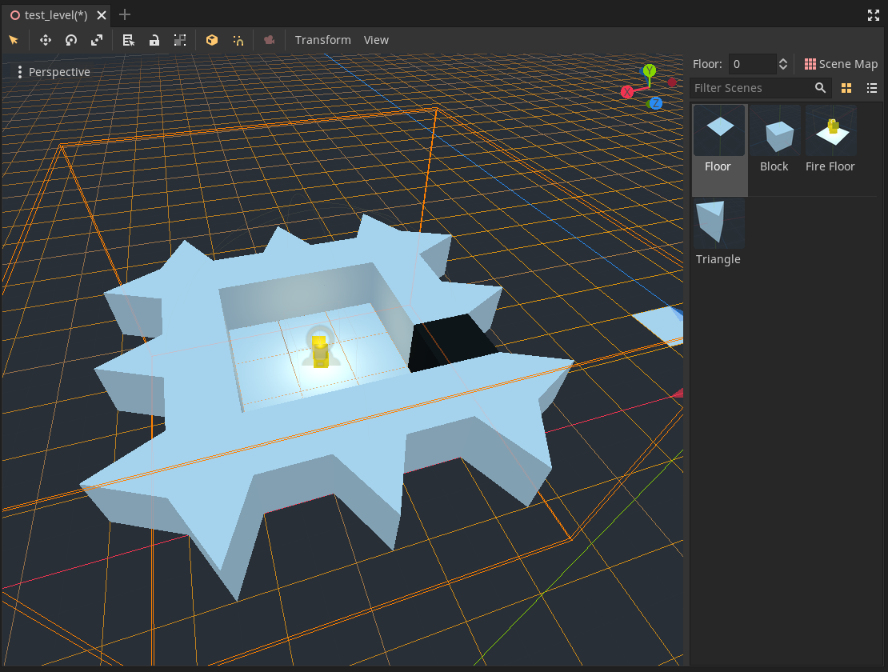

# SceneMap

Provides a helper node for building tile based worlds out of similarly sized scenes.

This repository only contains the add-on and development resources.  A demonstration project is planned for the future.

*WARNING: This addon is still in preview and is not recommended for production use.*



## Features

- SceneMap node with a similar feature set to GridMap.
- ScenePalette resource for grouping scenes painted into a SceneMap.
- Editor support for "painting" scenes and managing ScenePalettes.

### Comparison with GridMap

| Feature                | SceneMap    | GridMap |
| ---------------------- | :---------: | :-----: |
| **Painting**           |             |         |
| Paint                  | Yes         | Yes     |
| Erase                  | Yes         | Yes     |
| Pick From Viewport     | No          | Yes     |
| Change Elevation       | Yes         | Yes     |
| Edit X/Y/Z Planes      | Yes         | Yes     |
| Rotate Cursor          | Yes         | Yes     |
| **Cell Configuration** |             |         |
| Cell Size              | Yes         | Yes     |
| Cell Center (X/Y/Z)    | Yes         | Yes     |
| Cell Scale Override    | Not Planned | Yes     |
| **Selection**          |             |         | 
| Select Region          | No          | Yes     |
| Fill Region            | No          | Yes     |
| Clear Region           | No          | Yes     |
| Cut/Copy/Paste Region  | No          | Yes     |
| **Library**            |             |         |
| View Items             | Yes         | Yes     |
| Select Item            | Yes         | Yes     |
| Search Items           | Yes         | Yes     |
| Change Preview Size    | No          | Yes     |
| Supported Types        | Scenes      | Meshes  |
| **Optimization**       |             |         |
| Octant Batching        | Not Planned | Yes     |

### Roadmap

#### 1.0

- Pick item from 3D viewport
- Region Selection
  - Fill/Clear
  - Copy/Paste
- Versioned data format

#### 1.1

- Autotile support
- Multiple layers

## Installation

### Using the Asset Library

- Open the Godot editor.
- Navigate to the **AssetLib** tab at the top of the editor and search for "SceneMap".
- Install the [SceneMap](https://godotengine.org/asset-library/asset/878) plugin. Keep all files inside the `/addons/scene_map/` directory checked during installation.
- In the editor, open **Project > Project Settings**, go to **Plugins** and enable the **SceneMap** plugin.

### Manual installation

Manual installation lets you use pre-release versions of this add-on by following its `master` branch.

- Clone this Git repository:

```bash
git clone https://github.com/DarkKilauea/godot-scene-map.git
```

Alternatively, you can [download a ZIP archive](https://github.com/DarkKilauea/godot-scene-map/archive/master.zip) if you do not have Git installed.

- Move the `addons/` folder to your project folder.
- In the editor, open **Project > Project Settings**, go to **Plugins** and enable the **SceneMap** plugin.

## Usage

After installing the addon, use the create node dialog to add a `SceneMap` node to your scene.  SceneMaps require a ScenePalette to be created, which you can do from the `palette` property in the inspector while a SceneMap is selected.  Usage is similar to `GridMap`.

*TODO: Add a step by step tutorial here*

## License

Copyright (c) 2021 Josh Jones

Unless otherwise specified, files in this repository are licensed under the MIT license. See [LICENSE.md](LICENSE.md) for more information.
